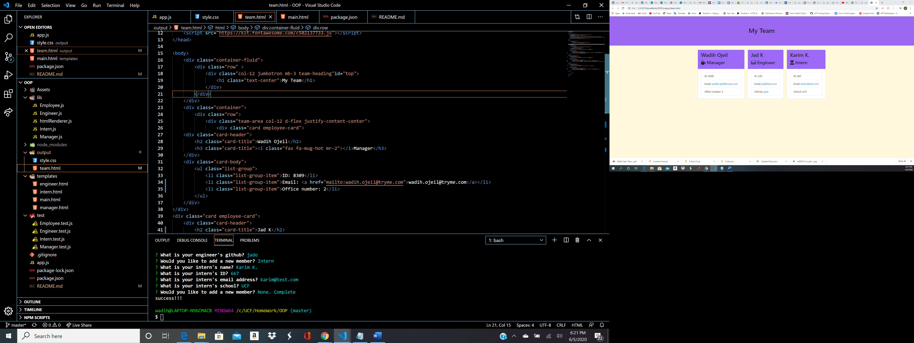

# My Team

Project Title
This is a Team generator application that runs through inquirer. Answering a couple of prompts on the terminal will generate an html file with your Team.

Getting Started
You can get a verison of this product up and running through heroku and can see the juicy backend code through the github
page.

Prerequisites
Install
-jest
-inquirer

Deployment
Node

Try Me Live
Fork Repo and run node app.js

Built With
Node 
Inquirer

Authors
Wadih Ojeil- Full Stack Web Developer

License
This project is licensed under the ISC License

## Purpose and Inspiration
A different way to use inquirer and generate an html file. Learning experience with how to test my code. The fun of it is I can create cards with my team members' info and print them out.

#### Install and run
Install all the dependencies with NPM
`npm install`  
Then start the project
`node app.js`

